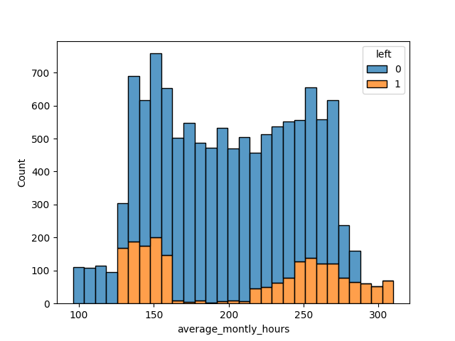
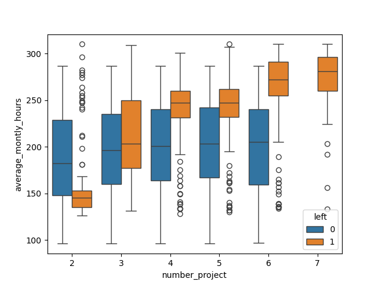
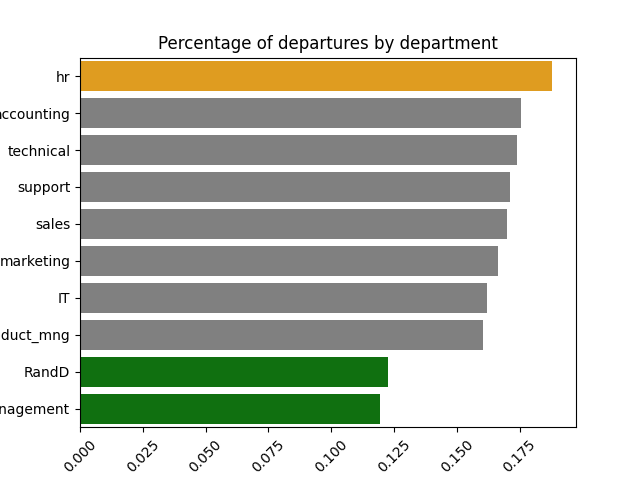

# Project summary
This project is a fictive analysis based on data provided by Kaggles.com.

The mandate is to generate insight on the high turnover rate of Saliford Motor based on a company survey containing 11991 non-null, non-duplicated entries figuring 10 columns of data each. 
```
View data dictionary for more information on different metrics used in the analysis
```
We then have to generate a prediction model for when an employee is at potential risk of leaving Saliford.

## Business takeaways 

Data exploration revealed valuable insights about Saliford's work force:




```
Burn out looks to be a significant factor in departures
```
- Employees working outside of the 160 to 210 hours a month range are at much higher risk of turnover, the average in the US being 176

- 100% of workers assigned 7 projects left the company, dropping to 45% when assigned 6
Regardless of number of projects assigned departures seem to be correlated to the time requiered by those project rather than to the projects themselves




```
3 departments stand out from the rest and would require further investigation
```

```
The promotions system does not look ideal for retention
```
- 98.3% of workers did not receive a promotion in the last 5 years
- 
```
Work accidents
```
```
Last evaluation
```
```
Satisfaction
```
- The third and fourth years seem to be a turning point in satisfaction levels 
## Presentation of the  model


## Chalenges
```
Learning to work in a multi-folder project template with version control
```
- Had to figure out how to save and load files to and from different folders and have them interact with one another without introducing bugs
- Lost a day of work due to forgetting to commit progress
## Next step


## Project Organization

```
├── LICENSE            <- Open-source license if one is chosen
├── README.md          <- The top-level README for developers using this project
├── data
│   ├── interim        <- Intermediate data that has been transformed
│   └── raw            <- The original, immutable data dump
│
├── models             <- Trained and serialized models, model predictions, or model summaries
│
├── notebooks          <- Jupyter notebooks. Naming convention is a number (for ordering),
│                         the creator's initials, and a short `-` delimited description, e.g.
│                         `1.0-jqp-initial-data-exploration`
│
├── references         <- Data dictionary
│
└─ reports            <- Generated analysis as HTML, PDF, LaTeX, etc.
    └── figures        <- Generated graphics and figures to be used in reporting