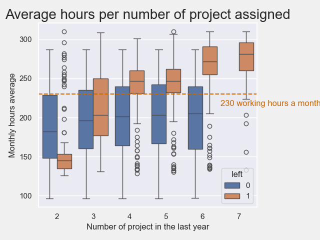
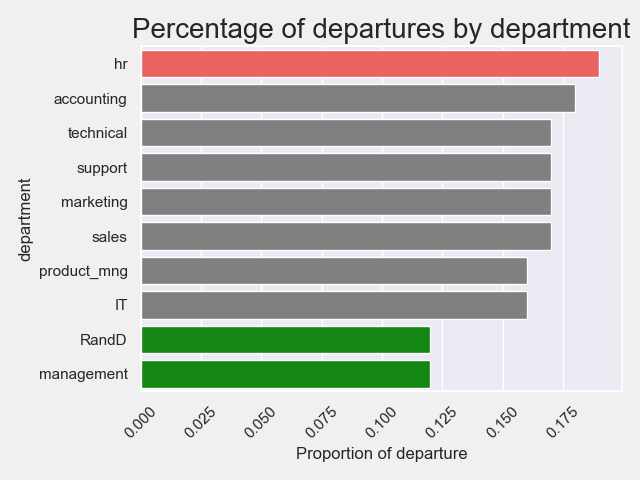
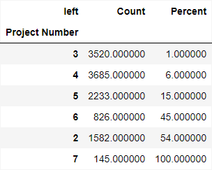
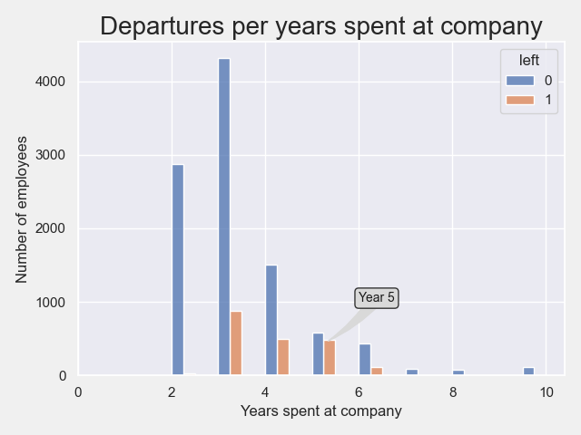
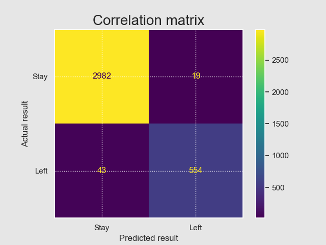
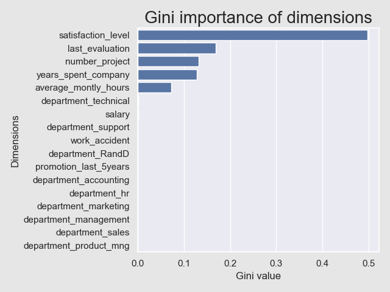

# Project summary
This project is a fictive analysis based on data provided by Kaggles.com, originating from the google career certificate for data analysis.

The mandate is to generate insight on the high turnover rate of Saliford Motor based on a company survey containing 11991 non-null, non-duplicated entries figuring 10 columns of data each. 
```
Notes: -View data dictionary in references folder for more information on the different metrics used in the analysis.
       -A folder structure template is also available at the end of this readme.
```
## Process

An initial EDA reveiled key insights as to where company leadership could further the investigation in hopes to reveal the exact cause of the departures.

A prediction model was then computed to help screen employees for potential risk of leaving Saliford, based on different metrics collected by the company.

## Business takeaways 

Data exploration revealed valuable insights about Saliford's work force:

Following charts show how the Monthly hours worked by saliford's employees relate to their tenure.

 

```
Insight: Burn out looks to be a significant factor in departures
```
- Employees working outside of the 160 to 220 hours a month range are at much higher risk of turnover, the average in the US being 176. A recommended maximum for monthly hours could be set to 220 hours to help this issue.

- 100% of workers assigned 7 projects left the company, dropping to 45% when assigned 6.

- Regardless of number of projects assigned, departures seem to be correlated to the time requiered by those project rather than to the projects themselves.

- 


```
Insight: 3 departments stand out from the rest and would require further investigation
```
The chart below shows percent of departure by departement.




```
Insight: The promotions system does not look ideal for retention
```
- 98.3% of workers did not receive a promotion in the last 5 years.
- Around 17% of employees who did not receive a promotion in the last 5 years departed, dropping to 4% if they did.
- Implementing a structure with more echelon could be a consideration to add a sense of progression in the work force.
- The number of promotions do not appear related to the number of hours worked, the number of project participated in nor to the last evaluation of the worker. They do however, appear to be correlated to their satisfaction levels. (View EDA for further details)
```
Insight: Aiming for 3 to 5 projects per employee could help lower departures
```


```
Insight: Satisfaction levels are dipping in the four year category
```
- 50% of the company repport a satisfaction level above 0.66 with 37% at or above 0.75.
- The third and fourth years seem to be a turning point in satisfaction levels. 


- 45% of year five left the company. 




Scatter chart below shows 3 distinct areas of departures:


- High work hours, low satisfaction: Most likely left from burn out
- High work hours, high satisfaction: Most likely left for higher paid job
- Low work hours, low satisfaction: Most likely fired for low performance  

## Presentation of the  model

The chosen model is tree based machine learning model.

- The requiered task is classification.

- EDA revealed a fair proportion of relevant outliers so we need an outlier resilient model.

- Logistic regression fits requierements, but it seems the tree model could add valuable insights to stakeholder by studying the branches, it then seems like a good first choice in a world where making both and comparing would require too much time.

## Model score



Best model chosen by f1 score


## Model results




## Chalenges
```
This project was my first experience with version control as well as working in a multiple folder project with interaction between multiple folders
```
- I had to figure out a clear organisation method to present the project. I settled on the cookiecutter data template that I adapted to my needs
- I lost a day of work due to forgetting to commit progress, had to learn the hard way to allways backup and update files.

## Next steps
```
 Investigate the three areas from the scatter chart further 
```
- Investigate performance statistics for employees between 0.3 and 0.5 in satisfaction_levels that are also in the 125 to 175 average_montly_hours range to confirm hypothesis about possible layoff due to low performance.
- Investigate salary and promotion metrics for employees between 0.75 and 1 satisfaction_levels that also fit the 225 hours and more category to confirm hypothesis about the group leaving for a higher paid job due to lack of advancement.
```
 Construct a logistic regression model to compare for better prediction score with the tree model if time permits.
```
```
 Get access to higher quality data
```
- Year since promotion would be better than promotion in last 5 years
- distinction between layoff and resignation.
```
 Generate dashboards for management to better track important metrics 
```
- Machine learning models can be a good tool, but an imperfect tool. Management must be equipped with good good data tools to add human insight wich is as much valuable to solving problems.

## Project Organization

```
├── LICENSE            <- Open-source license if one is chosen
├── README.md          <- The top-level README for developers using this project
├── data
│   ├── interim        <- Intermediate data that has been transformed
│   └── raw            <- The original, immutable data dump
│
├── models             <- Trained and serialized models, model predictions, or model summaries
│
├── notebooks          <- Jupyter notebooks. Naming convention is a number (for ordering),
│                         the creator's initials, and a short `-` delimited description, e.g.
│                         `1.0-jqp-initial-data-exploration`
│
├── references         <- Data dictionary
│
└─ reports            <- Generated analysis as HTML, PDF, LaTeX, etc.
    └── figures        <- Generated graphics and figures to be used in reporting